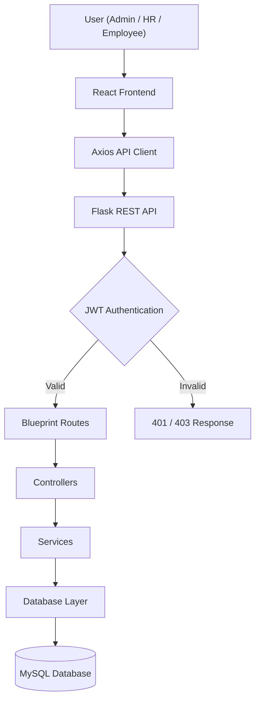

<div align="center">

  <!-- Animated Typing Header -->
  <a href="https://github.com/Tejas-ux257/HR_ERP_SYSTEM">
    
  </a>

  <p align="center">
    <strong>A modern, enterprise-grade Full Stack Human Resource Management Platform built for scalable workforce management and complete employee lifecycle automation.</strong>
  </p>

  <!-- Badges -->
  <p align="center">
    <a href="https://github.com/Tejas-ux257/HR_ERP_SYSTEM/stargazers"></a>
    <a href="https://github.com/Tejas-ux257/HR_ERP_SYSTEM/network/members"></a>
    <a href="https://github.com/Tejas-ux257/HR_ERP_SYSTEM/issues"></a>
    <a href="https://github.com/Tejas-ux257/HR_ERP_SYSTEM/blob/main/LICENSE"></a>
  </p>

  <p align="center">
    
    
    
    
    
    
  </p>

  <p align="center">
    <a href="#-key-features--role-matrix">Key Features</a> •
    <a href="#-system-architecture">Architecture</a> •
    <a href="#-database-schema--sql">Database Schema</a> •
    <a href="#-installation--setup">Quick Start</a> •
    <a href="#-api-documentation">API Docs</a>
  </p>

</div>

---

## 📌 Table of Contents

- [Overview](#-overview)
- [Industry Problem vs Proposed Solution](#-industry-problem-vs-proposed-solution)
- [Who Can Use This?](#-who-can-use-this)
- [Key Features & Role Matrix](#-key-features--role-matrix)
- [System Architecture](#-system-architecture)
- [Database Schema & SQL](#-database-schema--sql)
- [Technology Stack](#-technology-stack)
- [Project Directory Structure](#-project-directory-structure)
- [Installation & Setup](#-installation--setup)
- [API Documentation](#-api-documentation)
- [Security Implementation](#-security-implementation)
- [Deployment Guide](#-deployment-guide)
- [Future Roadmap](#-future-roadmap)
- [Troubleshooting & FAQ](#-troubleshooting--faq)
- [Contributing](#-contributing)
- [Author & Acknowledgments](#-author--acknowledgments)

---

## 🌟 Overview

Managing employees manually becomes increasingly complex as organizations grow. Many companies still rely on spreadsheets, paperwork, emails, and disconnected tools to track daily attendance, leave approvals, payroll generation, department assignments, and personal records.

The **HR ERP System** provides a centralized **Enterprise HR ERP Platform** that digitizes the entire employee lifecycle—from onboarding to monthly salary disbursement. The platform enhances operational transparency, cuts manual workload, eliminates human error in compensation math, and provides secure role-based access for Administrators, HR teams, and Employees.

---

## 🎯 Industry Problem vs Proposed Solution

| Industry Pain Points ❌ | HR ERP Platform Solution ✅ |
| :--- | :--- |
| **Manual & Error-Prone Attendance**: Paper logs or spreadsheets lead to time theft and tracking inaccuracies. | **Digital Check-In/Out Portal**: Real-time timestamps for check-in and check-out tied to attendance history. |
| **Opaque Leave Management**: Email chains result in delayed approvals, lost records, and scheduling conflicts. | **Automated Leave Workflow**: Self-service leave requests with real-time status updates (Pending/Approved/Rejected). |
| **Payroll Miscalculations**: Manual salary, allowance, and deduction calculations cause payroll discrepancies. | **Dynamic Salary Engine**: Automated monthly payroll processing factoring in base pay and deductions. |
| **Data Silos & Security Risks**: Unprotected spreadsheets lead to unauthorized viewing of sensitive salary data. | **JWT & Role-Based Security**: Strict Access Control ensuring users only see data explicitly permitted by their role. |
| **Lack of Employee Self-Service**: Employees must email HR repeatedly to check leave balances or pay records. | **Self-Service Dashboard**: Dedicated portal for employees to review profile, check attendance, and view pay history. |

---

## 🏢 Who Can Use This?

* 🏢 **Small & Medium Businesses (SMBs)** – Streamline HR workflows without expensive enterprise software.
* 🚀 **Startups** – Rapidly manage growing teams with clear role permissions.
* 🎓 **Educational Institutions** – Manage faculty, staff, department hierarchies, and attendance logs.
* 🏭 **Manufacturing & Corporate HR** – Centralize employee onboarding, shift check-ins, and monthly payroll.
* 💻 **IT Companies & Agencies** – Track remote or office staff with real-time dashboard analytics.

---

## ✨ Key Features & Role Matrix

### 1. Detailed Feature List

* 🔑 **Authentication & Authorization**: JWT-based login, password salting/hashing via bcrypt, session management, and protected client/server routes.
* 🏢 **Department Module**: Full CRUD operations for creating, editing, viewing, and deleting organizational departments.
* 👥 **Employee Management**: Register new staff, assign roles (Admin, HR, Employee), map departments, update personal info, and search directory.
* 🕒 **Attendance Tracking**: Real-time Check-In and Check-Out actions with timestamp logging and full user history.
* 📅 **Leave Management System**: Submit leave requests with custom date ranges and reasons; HR/Admin review and approve/reject requests.
* 💰 **Payroll Engine**: Generate monthly salary disbursements, manage basic pay vs deductions, and maintain printable history logs.
* 📊 **Multi-Role Dashboards**: Role-tailored home dashboards with real-time statistics, active clocks, and recent activity feeds.

---

### 2. Access Control Matrix

| Feature / Module | 👨‍💼 Admin | 👩‍💼 HR Manager | 👨‍💻 Employee |
| :--- | :---: | :---: | :---: |
| **View Analytics Dashboard** | Full System | Department Level | Personal Summary |
| **Create / Edit / Delete Departments** | ✅ | ❌ (Read Only) | ❌ |
| **Register & Manage Employees** | ✅ | ✅ | ❌ |
| **Mark Daily Attendance (Check-In/Out)** | ✅ | ✅ | ✅ |
| **Manage & Review All Attendance Logs** | ✅ | ✅ | Personal History Only |
| **Apply for Leave** | ✅ | ✅ | ✅ |
| **Approve / Reject Leave Requests** | ✅ | ✅ | ❌ |
| **Generate Monthly Payroll** | ✅ | ✅ | ❌ |
| **View Payroll Slips** | ✅ | ✅ | Personal Slips Only |
| **Update Personal Profile & Password** | ✅ | ✅ | ✅ |

---

## 🏗 System Architecture

The HR ERP System follows a **three-tier client-server architecture**. The React frontend communicates with the Flask backend through secure REST APIs. JWT authentication protects endpoints, while the backend processes business logic and stores data in MySQL.



    🗂 Database Schema & SQL1. Entity-Relationship Diagram (ERD)Code snippeterDiagram

   erDiagram
    USERS ||--o{ ATTENDANCE : "logs"
    USERS ||--o{ LEAVE_REQUESTS : "applies"
    USERS ||--o{ PAYROLL : "receives"
    DEPARTMENTS ||--o{ USERS : "belongs to"

    USERS {
        int id PK
        string full_name
        string email UK
        string password_hash
        enum role "Admin, HR, Employee"
        int department_id FK
        datetime created_at
    }

    DEPARTMENTS {
        int id PK
        string department_name UK
        string description
        datetime created_at
    }

    ATTENDANCE {
        int id PK
        int user_id FK
        date date
        time check_in
        time check_out
        enum status "Present, Absent, Half-Day"
    }

    LEAVE_REQUESTS {
        int id PK
        int user_id FK
        date start_date
        date end_date
        string reason
        enum status "Pending, Approved, Rejected"
        datetime applied_at
    }

    PAYROLL {
        int id PK
        int user_id FK
        string month_year
        decimal basic_salary
        decimal deductions
        decimal net_salary
        datetime generated_at
    }


2. Complete Database Setup Script (schema.sql)Execute this complete SQL initialization script in your MySQL environment:SQL-- Create Database
CREATE DATABASE IF NOT EXISTS hr_erp_db;
USE hr_erp_db;

-- 1. Departments Table
CREATE TABLE IF NOT EXISTS departments (
    id INT AUTO_INCREMENT PRIMARY KEY,
    department_name VARCHAR(100) NOT NULL UNIQUE,
    description TEXT,
    created_at TIMESTAMP DEFAULT CURRENT_TIMESTAMP
) ENGINE=InnoDB DEFAULT CHARSET=utf8mb4;

-- 2. Users / Employees Table
CREATE TABLE IF NOT EXISTS users (
    id INT AUTO_INCREMENT PRIMARY KEY,
    full_name VARCHAR(100) NOT NULL,
    email VARCHAR(100) NOT NULL UNIQUE,
    password_hash VARCHAR(255) NOT NULL,
    role ENUM('Admin', 'HR', 'Employee') NOT NULL DEFAULT 'Employee',
    department_id INT,
    created_at TIMESTAMP DEFAULT CURRENT_TIMESTAMP,
    FOREIGN KEY (department_id) REFERENCES departments(id) ON DELETE SET NULL
) ENGINE=InnoDB DEFAULT CHARSET=utf8mb4;

-- 3. Attendance Table
CREATE TABLE IF NOT EXISTS attendance (
    id INT AUTO_INCREMENT PRIMARY KEY,
    user_id INT NOT NULL,
    date DATE NOT NULL,
    check_in TIME,
    check_out TIME,
    status ENUM('Present', 'Absent', 'Half-Day') DEFAULT 'Present',
    FOREIGN KEY (user_id) REFERENCES users(id) ON DELETE CASCADE,
    UNIQUE KEY user_daily_attendance (user_id, date)
) ENGINE=InnoDB DEFAULT CHARSET=utf8mb4;

-- 4. Leave Requests Table
CREATE TABLE IF NOT EXISTS leave_requests (
    id INT AUTO_INCREMENT PRIMARY KEY,
    user_id INT NOT NULL,
    start_date DATE NOT NULL,
    end_date DATE NOT NULL,
    reason TEXT NOT NULL,
    status ENUM('Pending', 'Approved', 'Rejected') DEFAULT 'Pending',
    applied_at TIMESTAMP DEFAULT CURRENT_TIMESTAMP,
    FOREIGN KEY (user_id) REFERENCES users(id) ON DELETE CASCADE
) ENGINE=InnoDB DEFAULT CHARSET=utf8mb4;

-- 5. Payroll Table
CREATE TABLE IF NOT EXISTS payroll (
    id INT AUTO_INCREMENT PRIMARY KEY,
    user_id INT NOT NULL,
    month_year VARCHAR(20) NOT NULL,
    basic_salary DECIMAL(10, 2) NOT NULL,
    deductions DECIMAL(10, 2) DEFAULT 0.00,
    net_salary DECIMAL(10, 2) NOT NULL,
    generated_at TIMESTAMP DEFAULT CURRENT_TIMESTAMP,
    FOREIGN KEY (user_id) REFERENCES users(id) ON DELETE CASCADE
) ENGINE=InnoDB DEFAULT CHARSET=utf8mb4;

-- Initial Seed Data (Optional)
INSERT INTO departments (department_name, description) VALUES 
('Engineering', 'Software development and technical operations'),
('Human Resources', 'Talent acquisition, employee welfare, and compliance'),
('Finance', 'Accounting, payroll, and financial planning');
🧩 Technology StackFrontendCore Framework: React.js (v18+)Routing: React Router DOM (v6+)HTTP Client: AxiosUI Styling: Bootstrap 5Icons & Notifications: react-icons, react-toastifyBackendLanguage & Runtime: Python 3.11+Framework: Flask (using Blueprints)Authentication: PyJWTPassword Hashing: bcryptCORS Management: flask-corsDatabase & ToolsDatabase: MySQL 8.0Driver: PyMySQL / mysql-connector-pythonAPI Testing: PostmanVersion Control: Git & GitHub📂 Project Directory StructurePlaintextHR_ERP_SYSTEM/
│
├── app/                        # Backend Application Package
│   ├── controllers/            # Request handlers parsing client inputs
│   │   ├── auth_controller.py
│   │   ├── employee_controller.py
│   │   ├── attendance_controller.py
│   │   ├── leave_controller.py
│   │   └── payroll_controller.py
│   ├── services/               # Core business logic processing
│   ├── routes/                 # Flask Blueprints registration
│   ├── models/                 # SQL database models & queries
│   ├── validators/             # Request payload validation scripts
│   ├── utils/                  # JWT and security helper modules
│   ├── database.py             # Database connector pool setup
│   └── __init__.py             # Flask App Factory setup
│
├── frontend/                   # Client-Side React Application
│   ├── public/                 # Static HTML entry point & favicon
│   └── src/
│       ├── Admin/              # Admin administrative panels
│       ├── Employee/           # Employee self-service components
│       ├── Components/         # Shared Navigation, Sidebar, Modals
│       ├── Services/           # Axios instance & API method calls
│       ├── Pages/              # Primary route views (Login, Home)
│       ├── App.js              # Top-level routing & provider tree
│       └── index.js            # React DOM mounting initialization
│
├── .env.example                # Template for environment configuration
├── schema.sql                  # MySQL database initialization script
├── requirements.txt            # Python dependencies manifest
├── run.py                      # Backend server execution entry point
└── README.md                   # System documentation


# ⚙️ Installation & Setup

Follow the steps below to set up the **HR ERP System** on your local machine.

---

## 📋 Prerequisites

Before getting started, ensure the following software is installed:

| Software | Version |
|----------|---------|
| Python | 3.11+ |
| Node.js | 18+ |
| npm | Latest |
| MySQL Server | 8.0+ |
| Git | Latest |

---

# 🚀 Step 1: Clone the Repository

```bash
git clone https://github.com/Tejas-ux257/HR_ERP_SYSTEM.git

cd HR_ERP_SYSTEM
```

---

# 🗄️ Step 2: Database Configuration

Start your MySQL server.

Create the database and import the SQL schema.

```bash
mysql -u root -p
```

```sql
CREATE DATABASE hr_erp_db;
```

Import the database schema.

```bash
mysql -u root -p hr_erp_db < schema.sql
```

---

# 🐍 Step 3: Backend Setup (Flask)

## Create Virtual Environment

```bash
python -m venv venv
```

---

## Activate Virtual Environment

### Windows

```bash
venv\Scripts\activate
```

### macOS / Linux

```bash
source venv/bin/activate
```

---

## Install Python Dependencies

```bash
pip install -r requirements.txt
```

---

## Configure Environment Variables

Create a file named `.env` in the project root.

```env
DB_HOST=localhost
DB_USER=root
DB_PASSWORD=your_mysql_password
DB_NAME=hr_erp_db

JWT_SECRET_KEY=your_secret_key

PORT=5000
```

---

## Run the Flask Server

```bash
python run.py
```

Backend will be available at:

```
http://127.0.0.1:5000
```

---

# ⚛️ Step 4: Frontend Setup (React)

Navigate to the frontend folder.

```bash
cd frontend
```

---

## Install Node Packages

```bash
npm install
```

---

## Configure Frontend Environment

Create a `.env` file inside the **frontend** folder.

```env
VITE_API_BASE_URL=http://127.0.0.1:5000
```

> **Note:**  
> If your project uses **Create React App**, replace it with:

```env
REACT_APP_API_URL=http://127.0.0.1:5000
```

---

## Start the Frontend

For **Vite**

```bash
npm run dev
```

For **Create React App**

```bash
npm start
```

Frontend will be available at:

```
http://localhost:5173
```

or

```
http://localhost:3000
```

depending on your frontend configuration.

---

# ✅ Application URLs

| Service | URL |
|----------|-----|
| Frontend | http://localhost:5173 |
| Backend API | http://127.0.0.1:5000 |
| Database | MySQL (Localhost) |

---

# 📦 Project Setup Complete

After completing the above steps:

- ✅ Backend Server Running
- ✅ Frontend Running
- ✅ Database Connected
- ✅ JWT Authentication Ready
- ✅ HR ERP System Ready to Use


🧪 API Documentation

# 🧪 API Documentation

The backend exposes RESTful APIs that communicate using **JSON**.

---

## 🔐 Authentication APIs

| Method | Endpoint | Description | Access |
|---------|----------|-------------|--------|
| POST | `/login` | Login user | Public |
| POST | `/register` | Register user | Admin |

### Login Request

```json
{
  "username": "admin",
  "password": "Admin@123"
}
```

### Successful Response

```json
{
  "status": "success",
  "token": "JWT_TOKEN",
  "user": {
    "employee_id": 1,
    "username": "admin",
    "role": "Admin"
  }
}
```

---

## 🏢 Department APIs

| Method | Endpoint | Description | Access |
|---------|----------|-------------|--------|
| GET | `/departments` | Get all departments | Admin / HR |
| POST | `/departments` | Create department | Admin |
| PUT | `/departments/{id}` | Update department | Admin |
| DELETE | `/departments/{id}` | Delete department | Admin |

---

## 👨‍💼 Employee APIs

| Method | Endpoint | Description | Access |
|---------|----------|-------------|--------|
| GET | `/employees` | Get employees | Admin / HR |
| POST | `/employees` | Add employee | Admin / HR |
| PUT | `/employees/{id}` | Update employee | Admin / HR |
| DELETE | `/employees/{id}` | Delete employee | Admin |

---

## 🕒 Attendance APIs

| Method | Endpoint | Description |
|---------|----------|-------------|
| POST | `/employee/attendance/check-in` | Employee Check In |
| POST | `/employee/attendance/check-out` | Employee Check Out |
| GET | `/employee/attendance` | Attendance History |

---

## 📅 Leave APIs

| Method | Endpoint | Description |
|---------|----------|-------------|
| POST | `/employee/leave` | Apply Leave |
| GET | `/employee/leave` | Leave History |
| PUT | `/leave/{id}` | Approve / Reject Leave |

---

## 💰 Payroll APIs

| Method | Endpoint | Description |
|---------|----------|-------------|
| POST | `/payroll` | Generate Payroll |
| GET | `/payroll` | Payroll List |
| GET | `/employee/payroll` | Employee Payroll |

# 🔐 Security Implementation

The application follows industry-standard security practices.

## Authentication

- JWT Authentication
- Secure Login
- Token-Based Authorization

---

## Authorization

- Role-Based Access Control (RBAC)
- Admin Access
- HR Access
- Employee Access

---

## Password Security

- bcrypt Password Hashing
- Secure Password Storage
- Salted Password Encryption

---

## API Protection

- Protected REST APIs
- JWT Middleware
- Unauthorized Request Blocking

---

## Database Security

- Parameterized SQL Queries
- SQL Injection Prevention
- Input Validation

---

## Environment Security

Sensitive information is stored using environment variables.

```env
DB_PASSWORD=******
JWT_SECRET_KEY=******
```


# 🚀 Deployment Guide

## Backend Deployment

Supported Platforms

- Render
- Railway
- AWS EC2
- DigitalOcean

### Install Gunicorn

```bash
pip install gunicorn
```

### Start Command

```bash
gunicorn run:app
```

---

## Frontend Deployment

Supported Platforms

- Vercel
- Netlify

### Build Project

```bash
npm run build
```

Set the following environment variable:

```env
VITE_API_BASE_URL=https://your-backend-url.com
```

# 📈 Future Roadmap

## Planned Features

- [ ] Email Notifications
- [ ] SMS Notifications
- [ ] Face Recognition Attendance
- [ ] QR Code Attendance
- [ ] AI Attendance Insights
- [ ] Dashboard Analytics
- [ ] PDF Reports
- [ ] CSV Export
- [ ] Docker Support
- [ ] AWS Deployment
- [ ] CI/CD Pipeline
- [ ] Mobile Application


# 🤝 Contributing

Contributions are welcome.

### 1. Fork the Repository

Click the **Fork** button on GitHub.

---

### 2. Create a Feature Branch

```bash
git checkout -b feature/new-feature
```

---

### 3. Commit Your Changes

```bash
git commit -m "Add new feature"
```

---

### 4. Push Changes

```bash
git push origin feature/new-feature
```

---

### 5. Create a Pull Request

Open a Pull Request describing your changes.


# 👨‍💻 Author

<div align="center">

## Tejas Kumar D

**Computer Science & Engineering Graduate**  
**Full Stack Python Developer**

### 🌐 Connect with Me

GitHub: https://github.com/Tejas-ux257

LinkedIn: https://www.linkedin.com/in/YOUR-LINKEDIN

Email: tejaskumard2004@gmail.com

---

⭐ If you found this project useful, please consider giving it a **Star**.

Made with ❤️ using **React**, **Flask**, and **MySQL**

</div>
